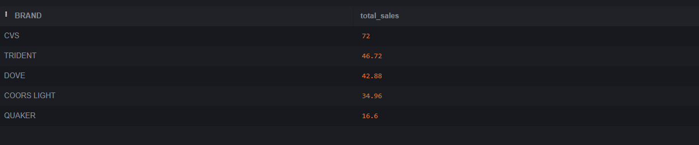

## - What are the top 5 brands by receipts scanned among users 21 and over?

```sql
SELECT brand, COUNT(receipt_id) AS receipt_num
FROM PRODUCTS_TAKEHOME p
LEFT JOIN TRANSACTION_TAKEHOME t
USING(barcode)
LEFT JOIN USER_TAKEHOME u
ON t.USER_ID = u.id
WHERE (julianday('now') - julianday(birth_date)) / 365.25 >= 21 AND (brand <> '')
GROUP BY brand
ORDER BY receipt_num DESC
LIMIT 5;
```


## - What are the top 5 brands by sales among users that have had their account for at least six months?

```sql
SELECT p.brand, SUM(t.FINAL_SALE) AS total_sales
FROM PRODUCTS_TAKEHOME p
LEFT JOIN TRANSACTION_TAKEHOME t
USING(barcode)
LEFT JOIN USER_TAKEHOME u
ON t.USER_ID = u.id
WHERE u.created_date <= DATE('now', '-6 months') AND (brand <> '')
GROUP BY p.brand
ORDER BY total_sales DESC
LIMIT 5;
```



## - What is the percentage of sales in the Health & Wellness category by generation?

```sql
WITH Generations AS (
    SELECT 
        u.id,
        CASE
            WHEN (strftime('%Y', 'now') - strftime('%Y', u.birth_date)) BETWEEN 18 AND 24 THEN 'Gen Z'
            WHEN (strftime('%Y', 'now') - strftime('%Y', u.birth_date)) BETWEEN 25 AND 40 THEN 'Millennials'
            WHEN (strftime('%Y', 'now') - strftime('%Y', u.birth_date)) BETWEEN 41 AND 56 THEN 'Gen X'
            ELSE 'Baby Boomers'
        END AS generation
    FROM USER_TAKEHOME u
)
SELECT 
    g.generation,
    ROUND(SUM(t.FINAL_SALE) * 100.0 / (SELECT SUM(final_sale) FROM TRANSACTION_TAKEHOME), 2) AS sales_percentage
FROM TRANSACTION_TAKEHOME t
JOIN Generations g ON t.user_id = g.id
JOIN PRODUCTS_TAKEHOME p ON t.barcode = p.barcode
WHERE p.category_1 = 'Health & Wellness'
GROUP BY g.generation;
```

